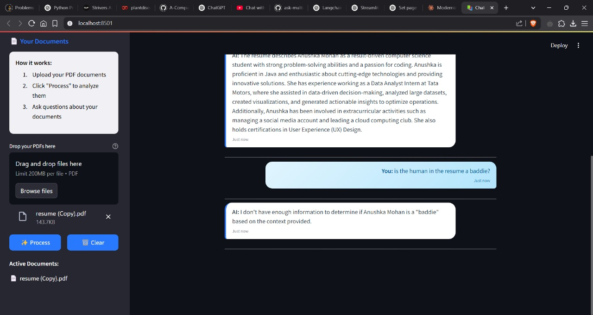

# 📚 AI PDF Chatbot

Chat with your PDFs using the power of **LangChain**, **OpenAI**, and **FAISS** — all wrapped in a slick **Streamlit interface**.

This app lets you upload multiple PDFs and ask natural language questions about their content. It uses semantic search and a conversational AI model (GPT-3.5/4) to retrieve and answer based on your document context.

---

## 🚀 Demo

  
> Upload PDFs → Process → Chat in natural language

---

## 🧠 How It Works

1. **You upload one or more PDFs** through the sidebar of the app. These could be reports, manuals, research papers—anything.

2. The app **reads all the text** from those PDFs using a PDF parser. This raw text might be hundreds of lines long.

3. It then **splits the text into smaller, overlapping chunks** (like paragraphs), so they’re easier for the AI to handle. Think of this as breaking a book into pages.

4. Each chunk is **converted into a vector**—a mathematical representation that captures the *meaning* of the text. This is done using **OpenAI’s embedding model**.

5. All these vectors are stored in a **FAISS vector database**, which acts like a super-fast "search engine for meaning."

6. Now, when you **ask a question**, like:
   > “What findings are mentioned in the scan report?”

   your question is also converted into a vector.

7. The app searches the FAISS database for **chunks that are semantically similar** (even if the words don’t exactly match).

8. The most relevant chunks are **passed to ChatGPT**, which reads them along with your question and responds intelligently—like it’s read your documents.

9. The conversation is **remembered**, so you can ask follow-up questions naturally.

---

## 🛠️ Features

- 🧾 Upload and chat with **multiple PDFs**
- ⚡ Built with **LangChain + FAISS + OpenAI**
- 🧠 Remembers previous questions in the chat
- 🎯 Retrieves **semantic matches** from documents
- 💬 Clean Streamlit chat UI with custom templates

---

## 📂 Project Structure

```bash
├── main.py                # Main Streamlit app
├── htmlTemplates.py       # Custom HTML & CSS for chatbot UI
├── .env                   # OpenAI API key stored securely
├── requirements.txt       # Python dependencies
```

---

## 🧑‍💻 Tech Stack

| Component         | Role                                            |
|------------------|-------------------------------------------------|
| **Streamlit**    | Frontend framework                              |
| **PyPDF2**        | Extracts text from uploaded PDFs                |
| **LangChain**     | Orchestrates LLM + retrieval + memory          |
| **OpenAI**        | Provides embeddings + GPT model responses       |
| **FAISS**         | Fast semantic search on text embeddings         |
| **dotenv**        | Loads API keys securely                        |

---
---

## ⚙️ Installation

1. **Clone the repo**
```bash
git clone https://github.com/yourusername/pdf-chat-ai.git
cd pdf-chat-ai
```

2. **Create `.env` file**
```env
OPENAI_API_KEY=your_openai_key
```

3. **Install dependencies**
```bash
pip install -r requirements.txt
```

4. **Run the app**
```bash
streamlit run main.py
```

---

## 📥 Requirements

See `requirements.txt` or install manually:

```bash
streamlit
PyPDF2
langchain
openai
faiss-cpu
python-dotenv
```

---

## ❓Usage

1. Go to the sidebar and **upload PDFs**
2. Click **Process**
3. Ask any question about the documents like:
   - "What abnormalities are found?"
   - "Summarize the second report"
   - "What is the diagnosis?"

---

## 🔐 Security

- `.env` is used to protect your OpenAI key
- API calls are handled server-side in Streamlit

---

## 📌 To-Do / Future Enhancements

- Add source highlighting and chunk citations
- Add document summarization button
- Support scanned OCR PDFs (e.g., with Tesseract)
- Integrate Whisper for audio-to-text documents

---

## 📄 License

MIT License

---

## 🙌 Acknowledgements

- [LangChain](https://github.com/langchain-ai/langchain)
- [OpenAI](https://platform.openai.com)
- [FAISS](https://github.com/facebookresearch/faiss)
- [Streamlit](https://streamlit.io)
